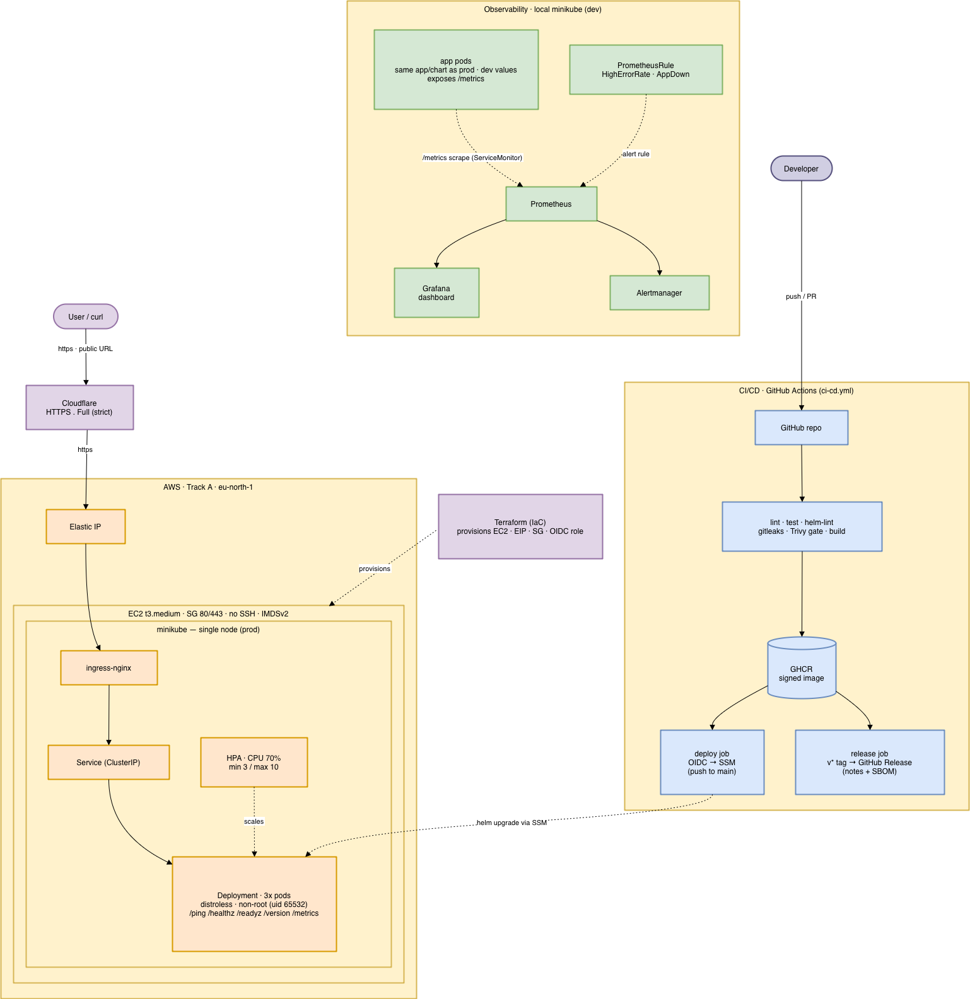
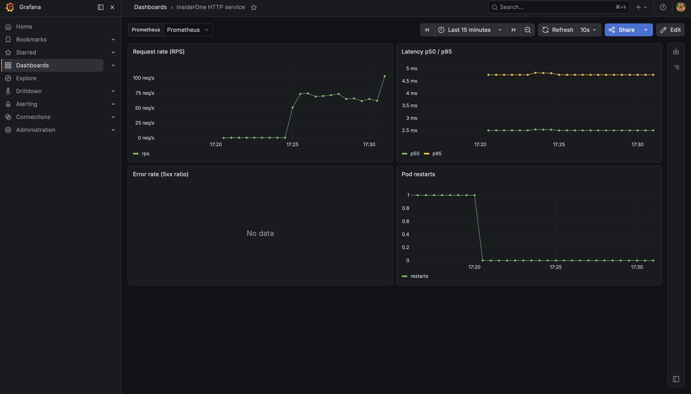

# insiderone-devops-case

A tiny Go HTTP service for the Insider One DevOps 2026 case study.
End-to-end slice: app → container → Helm/minikube → CI/CD → observability → public URL.

**Track:** A — minikube on AWS EC2, exposed over HTTPS on a custom domain. Live demo: `curl https://insiderone-devopscase.aysu-keskin.uk/ping` → `pong` ([evidence](docs/evidence/public-url/public-url-ping.png)).

Security posture and reporting: see [SECURITY.md](SECURITY.md). Design decisions: [`docs/adr/`](docs/adr/).

## Architecture



Client → Cloudflare (HTTPS) → Elastic IP → EC2 (minikube: ingress-nginx → Service → pods); TLS terminates at the ingress with a Let's Encrypt cert from cert-manager. CI/CD: GitHub Actions builds, scans (Trivy), signs (cosign), pushes to GHCR, then deploys to EC2 over SSM via OIDC. Observability (local): the app's `/metrics` → Prometheus → Grafana + Alertmanager. Vector version: [`docs/architecture.svg`](docs/architecture.svg).

## Endpoints

| Method | Path | Purpose |
|---|---|---|
| GET | `/ping` | returns `pong` |
| GET | `/healthz` | liveness probe (always 200 if process is up) |
| GET | `/readyz` | readiness probe (503 during shutdown drain) |
| GET | `/version` | build info: version, commit, built_at |
| GET | `/metrics` | Prometheus exposition: `http_requests_total`, `http_request_duration_seconds`, Go/process collectors |

## Quick start

```sh
make help          # list all targets
make docker-build  # build the container image
make docker-run    # run it on :8080
curl localhost:8080/ping        # → pong
```

## All Makefile targets

| Target | What it does | Needs |
|---|---|---|
| `make help` | list targets | — |
| `make run` | run server with `go run` | Go 1.25+ |
| `make build` | build local binary into `bin/server` | Go 1.25+ |
| `make test` | unit tests with race detector + coverage | Go 1.25+ |
| `make docker-test` | run tests inside a `golang:1.25` container | Docker only |
| `make lint` | `go vet ./...` | Go 1.25+ |
| `make docker-build` | multi-stage build, tags image with git SHA + `latest` | Docker |
| `make docker-run` | run container on `:8080`, read-only, all caps dropped | Docker |
| `make compose-up` | `docker compose up --build` (local dev) | Docker |
| `make compose-down` | `docker compose down` | Docker |
| `make scan` | Trivy scan, fails on `CRITICAL`/`HIGH` | Trivy |
| `make helm-lint` | lint the Helm chart against dev values | Helm |
| `make helm-template` | render templates locally for inspection | Helm |
| `make minikube-load` | load the locally-built image into minikube | minikube |
| `make deploy-dev` | `helm upgrade --install` with `values-dev.yaml` | Helm + kubectl |
| `make deploy-prod` | `helm upgrade --install` with `values-prod.yaml` | Helm + kubectl |
| `make rollout-status` | wait for the current Deployment rollout (2 min cap) | kubectl |
| `make rollout-dev` | `deploy-dev` then wait for pods to be Ready | Helm + kubectl |
| `make rollout-prod` | `deploy-prod` then wait for pods to be Ready | Helm + kubectl |
| `make rollback` | `helm rollback` to previous revision, then wait for Ready | Helm + kubectl |
| `make helm-history` | show release revision history | Helm |
| `make helm-uninstall` | remove the release | Helm |
| `make clean` | remove `bin/` | — |

If Go isn't installed locally, use `make docker-test` / `make docker-build` / `make docker-run` — Docker is enough.

## Environment variables

| Var | Default | Notes |
|---|---|---|
| `PORT` | `8080` | container listen port (must be ≥ 1024, non-root) |
| `HOST_PORT` | `8080` | host port mapped by docker compose only |
| `LOG_LEVEL` | `info` | `debug` / `info` / `warn` / `error` |

See `.env.example`. In production (Kubernetes), config comes from the ConfigMap in the Helm chart, not `.env`.

## Deploy to Kubernetes (local minikube)

```sh
minikube start --driver=docker --cpus=2 --memory=4096
minikube addons enable ingress
minikube addons enable metrics-server   # for HPA in prod values
make docker-build
make minikube-load                       # push the local image into minikube
make rollout-dev                         # deploy dev (1 replica, debug) then wait
make rollout-prod                        # deploy prod (3 replicas, HPA) then wait
make helm-history
make rollback                            # revert to the previous revision and wait for Ready
```

`make deploy-dev` and `make deploy-prod` set `image.pullPolicy=Never` only for
this local minikube flow, because the image is loaded directly into minikube.
For the later EC2/GHCR deployment, the chart default `IfNotPresent` is used
instead, or CI can override it explicitly.

The `values-dev.yaml` and `values-prod.yaml` deliberately differ on replica count, log level, resources, ingress host, and HPA settings — see those files for the deltas. Resource requests/limits are conservative starting estimates for a static Go binary that idles near zero CPU and ~10 Mi memory; dev sits at the floor (50m / 64Mi requests) and prod doubles both for traffic headroom. They will be tuned against real `kubectl top pod` numbers once load is generated in Day 4.

### Environments: dev = local, prod = cloud

The two values files map to where each is actually run:

| | `values-dev.yaml` | `values-prod.yaml` |
|---|---|---|
| Runs on | local minikube (laptop) | EC2 minikube (cloud) |
| Driven by | `make rollout-dev` | the CD pipeline |
| Replicas / logs | 1 / debug | 3 + HPA / info |
| Ingress | `tiny.dev.local` | `insiderone-devopscase.aysu-keskin.uk` (HTTPS) + raw-IP catch-all |

`dev` is the local developer loop; `prod` is the real cloud target. We intentionally do **not** run a second `dev` release on the same EC2 host — one node gives no real isolation, so it would be a duplicate rather than a distinct environment, and prod's `helm --atomic` already guards against a bad image. See `docs/adr/day-3-decisions.md` (ADR 009).

### Rollout strategy

Deployments use an explicit `RollingUpdate` with `maxSurge: 1, maxUnavailable: 0`. The intent is **safe and verifiable rollout/rollback over raw speed** — we'd rather have a predictable pod footprint in small clusters (minikube on a laptop, single-node EC2) than save a handful of seconds by surging to 2× replicas. Even when HPA scales us to 10 replicas, only one extra pod ever exists during a rollout. At `maxUnavailable: 0` the chart never drops below desired capacity, so client requests keep flowing while the new image takes over. This pairs with the app's graceful SIGTERM drain to deliver true zero-downtime rollouts.

### Rollout & rollback exercise

The `/version` endpoint makes rollouts observable end-to-end. With `helm upgrade --set image.tag=<new>` the response flips to the new tag; `helm rollback` immediately flips it back. Evidence captured to `docs/evidence/rollout/version-before-bump.txt`, `version-after-bump.txt`, `version-after-rollback.txt`, plus `helm-history-final.txt` showing the full revision chain (install → upgrade → upgrade → upgrade → rollback → upgrade → rollback). Live cluster state — `get pods` / `helm list` / `helm history` / `rollout status` — in [`docs/evidence/rollout/kubectl-helm-status.png`](docs/evidence/rollout/kubectl-helm-status.png).

## Chaos test

Killed one pod from a 3-replica deployment to observe Kubernetes self-healing:

```sh
kubectl delete pod <one-of-three-pods>
```

A replacement pod was scheduled within ~2 seconds and reached `Ready` shortly after. Replica count stayed at 3 throughout because HPA's `minReplicas: 3` floor enforces it independent of CPU metrics. What I learned: the Deployment controller doesn't wait for the dead pod to be `Terminated` before creating the replacement — it reacts to the desired-vs-actual delta immediately, so a graceful shutdown drain and a new pod's startup overlap cleanly. Evidence in `docs/evidence/chaos/chaos-*.txt`.

## Production-aware extras

- **Multi-stage Dockerfile** → distroless `static-debian12:nonroot` base pinned by digest, non-root uid `65532`, ~7 MB image.
- **Docker `HEALTHCHECK`** → uses `/server healthcheck`, so the distroless runtime image does not need curl, wget, or a shell.
- **OCI image labels** (`org.opencontainers.image.source` etc.) so GHCR links the image back to the repo.
- **`/healthz` vs `/readyz`** wired to liveness vs readiness probes separately.
- **Request-ID middleware** generates `X-Request-ID` per request and emits it on every log line.
- **Structured JSON logs** via `log/slog` — fields: `timestamp, level, msg, request_id, method, path, status, duration_ms`. `/healthz`, `/readyz`, `/metrics` are demoted to `DEBUG` to avoid probe noise.
- **Graceful shutdown** — on SIGTERM, flips `/readyz` to 503 and drains in-flight requests (15s deadline) so Kubernetes rolling updates don't drop traffic.

## CI/CD

`.github/workflows/ci-cd.yml` runs on every PR and push: lint + race tests, gitleaks secret scan, helm lint, and a Trivy image scan that fails on CRITICAL/HIGH. On `main` and `v*` tags it also pushes to GHCR, signs the image with cosign (keyless OIDC), and produces + attests an SPDX SBOM. A push to `main` ends with an auto-deploy to EC2 over SSM; a `v*` tag cuts a GitHub Release instead (deploy is skipped).

- [Green pipeline run](docs/evidence/cicd/ci-green.png) — `main` push: build → scan → sign → SBOM → deploy to EC2
- [Release run](docs/evidence/cicd/release-run.png) — `v0.1.0` tag: GitHub-release job runs, deploy correctly skipped

Verify a published image's signature:

```sh
cosign verify ghcr.io/aysukeskin/insiderone-devops-case:0.1.0 \
  --certificate-identity-regexp 'https://github.com/AysuKeskin/insiderone-devops-case/.*' \
  --certificate-oidc-issuer https://token.actions.githubusercontent.com
```

## Cloud infrastructure

Track A target: a single EC2 host in `eu-north-1` running minikube, reachable on an Elastic IP. Provisioned with Terraform under `infra/terraform/`.

```sh
cd infra/terraform
terraform init
terraform apply             # ~3 min; spins up EC2 + EIP + SG + GitHub OIDC role
terraform output            # AWS_REGION, AWS_ROLE_ARN, EC2_INSTANCE_ID for GH secrets
terraform destroy           # full teardown when the demo window is closed
```

The stack is intentionally narrow: no SSH (port 22 is closed at the SG), no long-lived AWS keys (GitHub Actions assumes the `gha_deploy` role via OIDC), and no GHCR secret on the host (the image is published as a public package, so minikube pulls anonymously). See `docs/adr/day-3-decisions.md` for the deploy-via-SSM and `t3.medium` tradeoffs.

## Observability

The app exposes Prometheus metrics at `/metrics` (`http_requests_total`, `http_request_duration_seconds`, plus Go/process collectors). Monitoring runs on **local minikube** (the EC2 box is sized for the app, not a full stack — see `docs/adr/day-4-decisions.md`).

```sh
make monitoring-install                  # kube-prometheus-stack into the `monitoring` ns
# deploy the app with the Prometheus Operator objects switched on:
helm upgrade --install insiderone-devops-case helm/insiderone-devops-case \
  -f helm/insiderone-devops-case/values-dev.yaml \
  --set image.pullPolicy=Never \
  --set metrics.serviceMonitor.enabled=true \
  --set metrics.prometheusRule.enabled=true
make monitoring-prometheus               # localhost:9090 → Status/Targets shows our endpoint UP
make monitoring-grafana                  # localhost:3000 → import docs/dashboards/insiderone-http.json
make load-gen                            # generate traffic so the panels move
```

Grafana admin password: `kubectl -n monitoring get secret monitoring-grafana -o jsonpath='{.data.admin-password}' | base64 -d`.

The dashboard (`docs/dashboards/insiderone-http.json`) shows RPS, p50/p95 latency, 5xx error rate, and pod restarts. Two alerts ship as a `PrometheusRule`: `HighErrorRate` (5xx ratio > 5% for 5m) and `AppDown` (target unscrapable for 2m). The `serviceMonitor`/`prometheusRule` toggles default to **off** so a normal install never needs the Prometheus Operator CRDs.



Evidence captured from a local run:
- [Grafana dashboard](docs/evidence/observability/grafana-dashboard.png) — RPS, latency, pod restarts
- [Prometheus target UP](docs/evidence/observability/prometheus-targets.png) — the app's ServiceMonitor endpoint scraping
- [Scraped metrics](docs/evidence/observability/prometheus-metrics.png) — `http_requests_total` by route
- [Alert rules loaded](docs/evidence/observability/alert-rules.png) — `HighErrorRate` + `AppDown`

## Bonuses

Beyond the core slice: three "going further" items (#2, #4, #6) plus the Day 2 HPA bonus — each with a note on how and what it taught:

- **Supply chain** — CI signs every image with cosign (keyless OIDC), produces a Syft SPDX SBOM, and binds it to the image with `cosign attest`. *Learned:* keyless signing needs `id-token: write`, and an SBOM is far more useful as an attestation (verifiable against the digest) than a loose file. Verify commands in [SECURITY.md](SECURITY.md).
- **Custom domain + TLS** — HTTPS via cert-manager + Let's Encrypt with a DNS-01 (Cloudflare) challenge; the ingress terminates TLS behind Cloudflare Full (strict). *Learned:* DNS-01 is far more robust than HTTP-01 behind a Cloudflare proxy, and a token with a trailing newline surfaces as Cloudflare error 6111 (header format), not an auth error. Setup in [RUNBOOK.md](RUNBOOK.md) → "TLS / HTTPS".
- **Chaos test** — killed a pod and watched the Deployment self-heal (see [Chaos test](#chaos-test) above). *Learned:* the controller reacts to the desired-vs-actual delta immediately, so drain and new-pod startup overlap cleanly.
- **HPA (Day 2 bonus)** — CPU-based autoscaling, min 3 / max 10 at 70%. *Learned:* HPA needs metrics-server + resource requests to compute utilization, and `minReplicas` is a hard floor independent of CPU.

## AI usage

I used AI assistants (Claude Code and ChatGPT/Codex) as pair programmers for
scaffolding, command sequencing, debugging, and documentation review — drafting
Makefile/Helm/TLS steps, explaining CI/CD and cert-manager errors, and tightening
the README, RUNBOOK, and ADR wording. I owned the architecture decisions and
secret handling, made the final call on every edit, and verified the result
myself with local tests plus `helm`, `kubectl`, AWS SSM, GitHub Actions, and live
endpoint checks.

## Layout

| Path | Contents |
|---|---|
| `cmd/server/` | entrypoint + lifecycle (graceful shutdown) |
| `internal/handlers/` | `/ping` `/healthz` `/readyz` `/version` |
| `internal/middleware/` | request-id, access log, metrics |
| `internal/metrics/` | Prometheus collectors (`http_requests_total`, duration histogram) |
| `internal/version/` | ldflags-populated build info |
| `helm/insiderone-devops-case/` | chart: Deployment, Service, Ingress, ConfigMap, Secret, HPA, ServiceMonitor, PrometheusRule, `values-dev/prod.yaml` |
| `infra/terraform/` | EC2, EIP, SG, IAM OIDC role (Track A) |
| `.github/workflows/` | `ci-cd.yml`: build → scan → sign → push → SSM deploy |
| `docs/adr/` | architecture decision records (Days 1–4) |
| `docs/dashboards/` | Grafana dashboard JSON |
| `docs/evidence/` | evidence by theme: `cicd/`, `observability/`, `rollout/`, `chaos/` |
| `docs/architecture.*` | architecture diagram (draw.io — PNG embed + SVG vector/source) |
